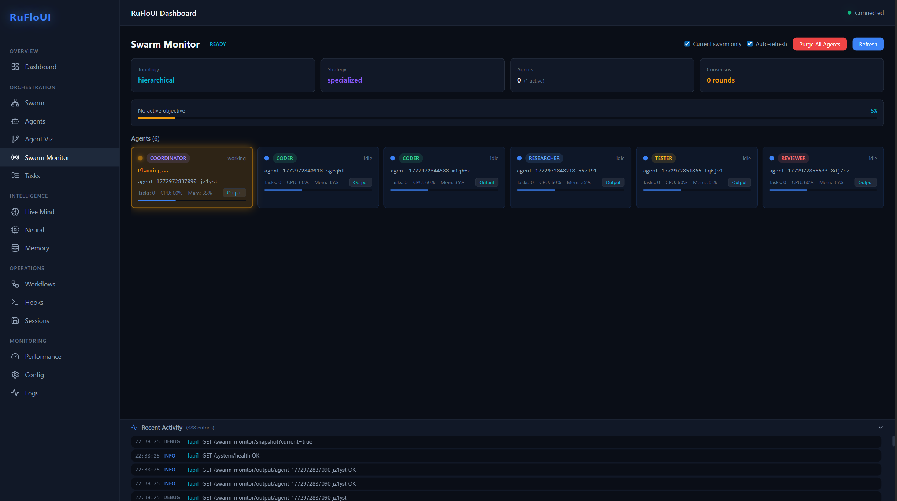

# RuFloUI



A React 19 web dashboard for [claude-flow v3](https://github.com/ruvnet/claude-flow) multi-agent orchestration. RuFloUI wraps the claude-flow CLI behind an Express + WebSocket backend and presents a full visual interface for managing swarms, agents, tasks, and workflows.

## Features

- **Swarm Management** — Initialize, configure, and shut down multi-agent swarms with visual topology controls
- **Agent Monitoring** — Real-time agent status cards with live output streaming, status-colored indicators, and working animations
- **Agent Visualization** — Tree view of agent hierarchies built from JSONL session logs in real-time
- **Task Board** — Kanban-style task management with create, assign, execute, and continue workflows
- **Task Continuation** — Follow-up on completed/failed tasks with automatic context injection from previous results
- **Output History** — All task output persisted to disk and viewable across page reloads and server restarts
- **Multi-Agent Pipeline** — Coordinator plans subtasks, workers execute in dependency waves, results synthesized
- **Hive Mind** — Consensus protocols, broadcast messaging, and shared memory across agents
- **Workflows** — Create and manage multi-step execution workflows
- **Performance** — Benchmarking, latency/throughput charts, bottleneck analysis
- **Memory Store** — Key-value memory with namespace support and semantic search
- **Neural Network** — Training, optimization, and pattern monitoring
- **Sessions** — Save and restore orchestration state
- **Hooks** — Event-driven hook configuration
- **Configuration** — Runtime config editor with import/export
- **State Persistence** — Full backend state persisted to `.ruflo/` with debounced writes and crash recovery

## Tech Stack

| Layer | Technology |
|-------|-----------|
| Frontend | React 19, Vite 6, TypeScript, Zustand, Recharts, Lucide Icons |
| Backend | Express, WebSocket (ws), Node.js |
| CLI | [claude-flow v3](https://github.com/ruvnet/claude-flow) (`npx @claude-flow/cli@latest`) |
| AI | [Claude Code CLI](https://docs.anthropic.com/en/docs/claude-code) for multi-agent execution |

## Quick Start

```bash
# Clone the repository
git clone https://github.com/Mario-PB/rufloui.git
cd rufloui

# Install dependencies
npm install

# Start both frontend and backend
npm run dev
```

This starts:
- **Frontend** (Vite) on `http://localhost:5173`
- **Backend** (Express + WebSocket) on `http://localhost:3001`

The frontend proxies `/api/*` and `/ws` to the backend automatically.

### Individual Services

```bash
npm run dev:frontend   # Vite dev server on port 5173
npm run dev:backend    # Express API on port 3001 (auto-reloads)
```

### Production Build

```bash
npm run build          # TypeScript check + Vite production build -> dist/
npm run preview        # Preview the production build
```

## Project Structure

```
src/
├── backend/
│   ├── server.ts          # Express API + WebSocket + multi-agent pipeline
│   └── jsonl-monitor.ts   # Real-time JSONL session file monitoring
└── frontend/
    ├── main.tsx            # Entry point
    ├── App.tsx             # Router, WebSocket handler, data fetching
    ├── api.ts              # API client (typed fetch wrapper)
    ├── store.ts            # Zustand global state with sessionStorage persistence
    ├── types.ts            # TypeScript interfaces
    ├── styles/
    │   └── global.css      # CSS variables, dark theme, animations
    ├── components/
    │   ├── Layout.tsx       # App shell with sidebar navigation
    │   ├── ErrorBoundary.tsx
    │   └── ui/              # Button, Card, StatusBadge
    └── pages/
        ├── Dashboard.tsx        # System health, agent overview
        ├── SwarmPanel.tsx       # Swarm init/shutdown/config
        ├── SwarmMonitorPanel.tsx # Real-time agent cards with output
        ├── AgentsPanel.tsx      # Agent lifecycle management
        ├── AgentVizPanel.tsx    # JSONL-based agent tree visualization
        ├── TasksPanel.tsx       # Kanban task board with continuation
        ├── WorkflowsPanel.tsx   # Workflow management
        ├── HiveMindPanel.tsx    # Consensus and broadcast
        ├── MemoryPanel.tsx      # Key-value memory store
        ├── NeuralPanel.tsx      # Neural network status
        ├── PerformancePanel.tsx # Benchmarks and charts
        ├── SessionsPanel.tsx    # Save/restore sessions
        ├── HooksPanel.tsx       # Hook configuration
        ├── ConfigPanel.tsx      # Configuration editor
        └── LogsPanel.tsx        # Live activity logs
```

## Architecture

```
Browser (React 19)                    Express Backend
┌────────────────────┐               ┌────────────────────────┐
│  Vite :5173        │───REST /api──>│  Express :3001         │
│  Zustand Store     │<──WebSocket──>│  WebSocket Server      │
│  sessionStorage    │               │                        │
└────────────────────┘               │  ┌──────────────────┐  │
                                     │  │ claude-flow CLI   │  │
                                     │  │ (npx @claude-flow │  │
                                     │  │  /cli@latest)     │  │
                                     │  └──────────────────┘  │
                                     │  ┌──────────────────┐  │
                                     │  │ Claude Code CLI   │  │
                                     │  │ (claude -p)       │  │
                                     │  │ Multi-agent pipe  │  │
                                     │  └──────────────────┘  │
                                     │  ┌──────────────────┐  │
                                     │  │ .ruflo/           │  │
                                     │  │  state.json       │  │
                                     │  │  outputs/*.jsonl  │  │
                                     │  └──────────────────┘  │
                                     └────────────────────────┘
```

## Multi-Agent Pipeline

When a task is assigned to the swarm:

1. **Planning Phase** — Coordinator agent receives the task with `--max-turns 1` (no tool access), outputs a JSON plan breaking work into subtasks
2. **Execution Phase** — Each subtask dispatched to the matching specialist agent (researcher, coder, tester, reviewer) with full tool access, respecting dependency order
3. **Parallel Waves** — Independent subtasks run in parallel; dependent ones wait for prerequisites
4. **Completion** — Results synthesized, task marked complete, output persisted to disk

## Getting Started: Your First Swarm Task

Once the app is running, here's how to go from zero to a working multi-agent swarm in under a minute:

1. **Initialize a swarm** — Go to **Swarm** in the sidebar, pick a topology (e.g. `mesh`), and click **Initialize Swarm**.
2. **Spawn agents** — Go to **Agents**, select a type (e.g. `coder`), give it a name, and click **Spawn**. Repeat for other roles you need (`researcher`, `tester`, etc.).
3. **Create a task** — Go to **Tasks**, click **Create Task**, fill in a title and description (e.g. "Write a fibonacci function in Python with tests").
4. **Assign to swarm** — On the task card, click **Assign to Swarm**. The multi-agent pipeline kicks in: a coordinator plans subtasks, specialist agents execute them in parallel waves.
5. **Watch it live** — Switch to **Swarm Monitor** to see agent cards light up with real-time output and the orange working glow animation. Or open **Agent Viz** to see the full agent tree built from session logs.
6. **Continue if needed** — When a task completes, click **Continue Task** to send a follow-up instruction with full context from the previous run.

## Prerequisites

- **Node.js** >= 18
- **claude-flow CLI** — installed automatically via `npx @claude-flow/cli@latest`
- **Claude Code CLI** (optional) — required for multi-agent pipeline execution. [Install guide](https://docs.anthropic.com/en/docs/claude-code)

## Contributing

Contributions are welcome! Here's how you can help:

1. **Fork** the repository
2. **Create a branch** for your feature or fix: `git checkout -b feat/my-feature`
3. **Make your changes** — follow the existing code style (TypeScript, inline CSS, Zustand for state)
4. **Test** — run `npm run build` to make sure everything compiles
5. **Submit a PR** — describe what you changed and why

### Other ways to contribute

- **Give us a star** — It helps others discover the project and motivates us to keep improving it
- **Spread the word** — Share RuFloUI with your team, on social media, or in developer communities
- **Report bugs** — Open an issue with steps to reproduce
- **Suggest features** — We'd love to hear your ideas

## Support the Project

If RuFloUI is useful to you, consider buying us a coffee:

<a href="https://buymeacoffee.com/rufloui" target="_blank"></a>

## Security Considerations

### Autonomous Agent Execution

By default, RuFloUI runs Claude Code agents with `--dangerously-skip-permissions`, which allows agents to read, write, and execute commands without asking for confirmation. This is required for autonomous multi-agent orchestration — without it, every agent would block waiting for human approval on each action.

**To disable autonomous mode**, set the environment variable:

```bash
RUFLOUI_SKIP_PERMISSIONS=false
```

With this disabled, agents will require manual approval for each tool use, which effectively prevents autonomous swarm execution.

### Local-Only by Default

RuFloUI is designed for local development use. The API server binds to `localhost` and restricts CORS to the frontend origin. Do not expose the API to untrusted networks without adding authentication.

## Related Projects

- [claude-flow](https://github.com/ruvnet/claude-flow) — The CLI orchestration engine that powers RuFloUI
- [Claude Code](https://docs.anthropic.com/en/docs/claude-code) — Anthropic's CLI for Claude AI

## License

MIT
